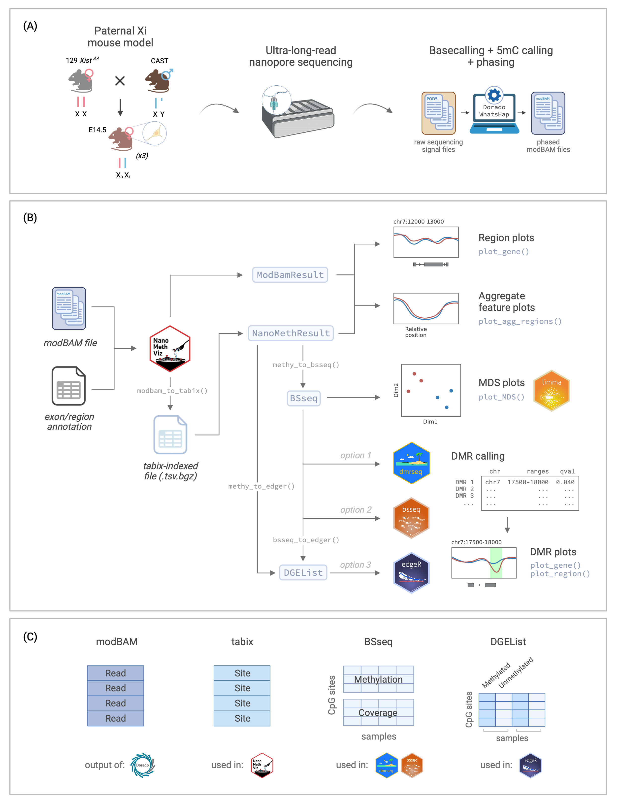

^1^The Walter and Eliza Hall Institute of Medical Research, Parkville, Victoria, Australia and Department of Medical Biology, The University of Melbourne, Parkville, Victoria, Australia.

^2^School of Life and Environmental Sciences, University of Sydney, Sydney, New South Wales, Australia.

```{r, cache = FALSE, include = FALSE}
knitr::opts_chunk$set(message = FALSE)
knitr::opts_chunk$set(out.width = 600)
knitr::opts_chunk$set(fig.width = 8.2)
knitr::opts_chunk$set(fig.height = 5.3)
```

# Abstract

Long-read sequencing technologies have transformed the field of epigenetics by enabling direct, single-base resolution detection of DNA modifications, such as methylation. This produces novel opportunities for studying the role of DNA methylation in gene regulation, imprinting, and disease. However, the unique characteristics of long-read data, including the modBAM format and extended read lengths, necessitate the development of specialised software tools for effective analysis. The `NanoMethViz` package provides a suite of tools for loading in long-read methylation data, visualising data at various data resolutions. It can convert the data for use with other Bioconductor software such as `bsseq`, `DSS`, `dmrseq` and `edgeR` to discover differentially methylated regions (DMRs).

In this workflow article, we demonstrate the process of converting modBAM files into formats suitable for comprehensive downstream analysis. We leverage NanoMethViz to conduct an exploratory analysis, visually summarizing differences between samples, examining aggregate methylation profiles across gene and CpG islands, and investigating methylation patterns within specific regions at the single-read level. Additionally, we illustrate the use of dmrseq for identifying DMRs and show how to integrate these findings into gene-level visualization plots. Our analysis is applied to a triplicate dataset of haplotyped long-read methylation data from mouse neural stem cells, allowing us to visualize and compare the characteristics of the parental alleles on chromosome 7. By applying DMR analysis, we recover DMRs associated with known imprinted genes and visualise the methylation patterns of these genes summarised at single-read resolution. Through DMR analysis, we identify DMRs associated with known imprinted genes and visualize their methylation patterns at single-read resolution. This streamlined workflow is adaptable to common experimental designs and offers flexibility in the choice of upstream data sources and downstream statistical analysis tools.

# Keywords

DNA methylation, Differential methylation, Long-read sequencing, Epigenetics, Bioconductor

# Introduction

DNA methylation is a key epigenetic regulator of gene expression in mammals, involving the addition of a methyl group to cytosine or adenine nucleotides. In mammals, the predominant form of DNA methylation is 5-methylcytosine (5mC) in CpG dinucleotides. CpG methylation is involved in many important epigenetic processes, including differential gene expression, X-chromosome inactivation, genomic imprinting, and maintenance of genome stability [@jinDNAMethylationSuperior2011]. Changes in CpG methylation are implicated in a variety of different disease processes, including tumorigenesis and imprinting disorders such as Prader-Willi Syndrome and Angelman Syndrome [@robertsonDNAMethylationHuman2005].

Over the past couple of decades, multiple methods have been developed to measure DNA methylation, including bisulfite sequencing [@frommerGenomicSequencingProtocol1992], methylation arrays [@pidsleyCriticalEvaluationIllumina2016], and more recently, third-generation sequencing technologies such as those offered by Oxford Nanopore Technologies (ONT) and Pacific Biosciences (PacBio). While bisulfite sequencing has long been the gold standard for DNA methylation analysis, it suffers from several limitations; these include DNA degradation from the process of bisulfite conversion, incomplete conversion of unmethylated cytosines, amplification bias from PCR, and short read lengths that pose difficulties for assembly and haplotyping [@gouilLatestTechniquesStudy2019]. By contrast, ONT’s nanopore sequencing and PacBio’s single-molecule real-time (SMRT) sequencing can directly sequence DNA molecules with all their modifications intact, and use basecalling algorithms to predict DNA modifications from the raw sequencing signal. Basecalling algorithms have the potential for bias, depending on the algorithm and training data used for the model; however, improvements are continually being made to generate more accurate models, and additionally, to detect other DNA modifications in other sequence contexts [@liuDNAMethylationAtlas2021a].

In this workflow, we will demonstrate how to use the `NanoMethViz` package [@suNanoMethVizBioconductorPackage2021a] and other Bioconductor software to visualise and analyse methylation data generated by ONT and PacBio long-read sequencing. The sequencing data is currently output in the modBAM file format, which contains the basecalled reads alongside tags for modification information. The `NanoMethViz` package provides a suite of tools for loading in this methylation data, visualising regional and genome-wide methylation patterns, and exporting data for identifying differentially methylated regions (DMRs) using other Bioconductor software such as `bsseq` [@hansenBSmoothWholeGenome2012], `DSS` [@parkDifferentialMethylationAnalysis2016], `dmrseq` [@korthauerDetectionAccurateFalse2019a] and `edgeR` [@chenDifferentialMethylationAnalysis2018] (Figure \@ref(fig:fig1)B).

# Experimental Setup

In this workflow, we will analyse ultra-long-read Nanopore sequencing data from the neural stem cells of triplicate E14.5 female mice [@gocukMeasuringInactivationSkew2024]. The mice were F1 crosses between an Xist knockout (X^ΔA^X) female [@royce-tollandArepeatLinksASF2010] and a Castaneus strain (CAST) male. The resulting offspring have sufficiently different parental chromosomes to allow effective genome-wide haplotyping to distinguish the parent-of-origin for long-reads, allowing for the identification of genes that are imprinted or strain-specific. The Xist KO of the maternal genome also guarantees that X-inactivation takes place on the paternal X chromosome, allowing for the study of X-inactivation. The DNA was sequenced on R9.4.1 PromethION flow cells, basecalled with Dorado, aligned to the mm10 mouse reference genome, and phased with WhatsHap [@martinWhatsHapFastAccurate2016], to produce the phased modBAM (Figure \@ref(fig:fig1)A). For illustrative purposes, we use a we use a subset of the data focusing on chromosome 7, which contains several known imprinted genes.

```{r fig1, echo=FALSE, fig.cap ="**Overview of the workflow**. (A) Experimental setup for the data used in this workflow, from Gocuk and Lancaster et al., 2024. (B) Flowchart of the workflow for long-read methylation data visualisation and analysis using `NanoMethViz` and other Bioconductor packages including `limma`, `dmrseq`, `bsseq`, and `edgeR`. (C) Summary of data structures for the storage of methylation data used in different parts of the workflow. Xi: inactive X. Xa: active X. CAST: Castaneus. 5mC: 5-methylcytosine. MDS: multidimensional scaling. DMR: differentially methylated region. Figure created with [BioRender.com](BioRender.com)."}

```

# Loading in data

```{r, message = FALSE, warning = FALSE, cache = FALSE}
library(BiocFileCache)
library(dmrseq)
library(dplyr)
library(readr)
library(plyranges)
library(NanoMethViz)
set.seed(1234)
```

We begin by loading the packages and downloading the input data which contains the modBAM files required for this workflow.

```{r}
if (!dir.exists("input")) {
    cache_path <- tools::R_user_dir("LongMod123", which = "cache")
    bfc <- BiocFileCache::BiocFileCache(cache_path, ask = FALSE)
    url <- "https://zenodo.org/records/12747551/files/input.tar.gz?download=1"
    
    qry <- BiocFileCache::bfcquery(bfc, url, exact = TRUE)

    if (nrow(qry) == 0) {
        input_path <- BiocFileCache::bfcadd(bfc, "input", fpath = url)
    } else {
        if (BiocFileCache::bfcneedsupdate(bfc, qry$rid)) {
            BiocFileCache::bfcdownload(bfc, qry$rid)
        }
        input_path <- bfc[[qry$rid]]
    }

    utils::untar(input_path, exdir = ".")
}
```

As mentioned, modBAM files are the currently preferred output of Dorado, the primary methylation caller offered by ONT. modBAM files are BAM files containing reads with additional tags on each read storing information about methylation calls (the MM tag) alongside their methylation probabilities (the ML tag). To use this data in `NanoMethViz`, we must construct an object of the `ModBamResults` class. 

The `ModBamResults` class is a container for storing methylation data from multiple samples, along with sample annotation and exon annotation. To create this object, we need to provide paths to the modBAM files, a sample table, and optionally exon annotation.

```{r}
# List the modBAM files by searching for files with the .bam extension in the input directory
bam_files <- dir("input", pattern = "*bam$", full.names = TRUE)
bam_files
```

The samples need to be annotated with information for `NanoMethViz` to use in aggregating data within experimental groups. The sample table must contain `sample` and `group` columns with optional additional columns for further annotation. The rows of this table must match the order of the input files. The `group` column is generally the default grouping column used in the `NanoMethViz` package. In this example, we have grouped our data by haplotype.

```{r}
samples <- read_tsv("input/sample_anno.tsv", show_col_types = FALSE)
samples
```

Optionally we can add exon annotation to the object to generate tracks for gene annotation when plotting genomic regions/genes. The exon annotation must be a `data.frame` with columns `gene_id`, `chr`, `strand`, `start`, `end`, `transcript_id`, and `symbol`. A number of helper functions are provided to retrieve exon annotations in the correct format for human (hg19, hg38) and mouse (mm10, GRCm39). In this example, we will use the `get_exons_mm10()` function to retrieve exon annotations for the mouse genome (mm10) and filter for chromosome 7.

```{r}
exon_anno <- get_exons_mm10() %>%
    dplyr::filter(chr == "chr7")
exon_anno
```

Once we have created the `ModBamResult` object, we can use the `plot_gene()` function to visualise the methylation patterns of a gene of interest. In this example, we will plot the methylation patterns of the *Peg3* (paternally-expressed gene 3) gene on chromosome 7, which is known to be imprinted in mice. The plot contains a smoothed trendline of the group-aggregated methylation probabilities across the gene, along with a heatmap showing the methylation probabilities of individual CpG sites in each read, and a track showing the isoforms of the gene if exon annotation is provided (Figure \@ref(fig:fig2-gene-peg3)).

```{r}
mbr <- ModBamResult(
    methy = ModBamFiles(
        paths = bam_files,
        samples = samples$sample
    ),
    samples = samples,
    exons = exon_anno,
    mod_code = "m"
)
```

```{r fig2-gene-peg3, fig.cap="**Gene-level plot of Peg3**. This plot shows the methylation information along the *Peg3* gene on chromosome 7. The top track shows a rolling-smoothed average of methylation probability across the region, aggregated across samples within each experimental group. The middle track shows a heatmap of the methylation probabilities within individual reads, separated by experimental group. The bottom track shows isoform annotations for *Peg3*, with rectangles representing exons, lines representing introns and arrows representing the direction of transcription."}
plot_gene(mbr, "Peg3")
```

CpG dinucleotides are often enriched around gene promoters, where methylation is generally correlated with silencing and hypomethylation with activation. In the plot, we see that there is a strong demethylation pattern on the paternal allele near the transcription start site (TSS) of the gene, allowing the gene to be expressed. The maternal allele is hypermethylated near the TSS, silencing the gene. This is a typical methylation pattern for an imprinted gene, and consistent with paternal expression of *Peg3*.

# Genome-wide analysis

While it is possible to use modBAM files to analyse specific regions of interest, genome-wide analysis requires the data to be in a tabix-indexed TSV file as it is easier to parse at scale (Figure C). We can convert the modBAM files to a tabix-indexed TSV file using the `modbam_to_tabix()` function. This function will create a tabix-indexed TSV file containing the methylation data from the modBAM files. This file can then be used as input to the `NanoMethViz` functions that require sorted genomic data. In this example, we will convert the `ModBamResult` object to a tabix-indexed TSV file and save it to the `data` directory. We will use a pre-generated file in the interest of time, but you can run the code below to generate the file.

```{r, warn = FALSE}
dir.create("data", showWarnings = FALSE)
if (!file.exists("data/methy.tsv.bgz")) {
    modbam_to_tabix(mbr, "data/methy.tsv.bgz")
}
```

Once we have the tabix-indexed TSV file, we can create a `NanoMethResult` object using the `NanoMethResult()` function. The `NanoMethResult` object contains the same information as the `ModBamResult` object but with the methylation data stored in a tabix-indexed TSV file. To create this object we need to provide paths to the tabix-indexed TSV file, along with the accompanying sample table and exon annotation we generated before.

```{r}
nmr <- NanoMethResult(
    methy = "data/methy.tsv.bgz",
    samples = samples,
    exons = exon_anno
)
```

The `NanoMethResult` object behaves in the same way as `ModBamResult` for any plotting functions. For example we can use `plot_gene()` to visualise the methylation patterns of the *Peg3* gene in exactly the same way but replacing the `ModBamResult` object with the `NanoMethResult` object. We should see the exact same plot as before.

```{r, eval=FALSE}
plot_gene(nmr, "Peg3")
```

# Aggregating feature methylation data

It is often informative to aggregate methylation data over a class of features to identify broad patterns of methylation across the features. This can help establish overall differences in methylation patterns between groups in a class of features such as genes, CpG islands, or enhancers. The `NanoMethViz` package provides a `plot_agg_regions()` function for visualising methylation data that has been aggregated across a set of genomic regions of interest, defined by a table of coordinates. 

For example, we may want to investigate the methylation patterns of a set of genes on chromosome 7. We can use the `exons_to_genes()` helper function to convert exon annotations already stored in the object to gene annotations and filter for only chromosome 7 genes (Figure \@ref(fig:fig3-gene-agg)). For faster processing, we subset 200 genes and use the `plot_agg_regions()` function to visualise the mean methylation proportions along the sampled genes. By default, the methylation proportion is calculated using a threshold of 0.5 modification probability.

```{r fig3-gene-agg, fig.cap="**Aggregated gene-level plot**. The mean methylation proportion is shown across a sample of 200 genes in chromosome 7, aggregated by experimental group. Methylation proportions are individual CpG sites are calculated along relative genomic positions, with fixed flanking regions, then averaged across all genes in each experimental group to produce a smoothed trendline. The x-axis label gives the average width and standard deviation of widths of the features used."}
gene_anno <- exons_to_genes(exons(nmr))
plot_agg_regions(nmr, regions = slice_sample(gene_anno, n = 200), group_col = "group")
```

In this plot we can see that active genes on chromosome 7 tend to be demethylated near the TSS region and hypermethylated throughout the gene body. This is consistent with the proposed function of methylation in gene regulation, where methylation in promoter region of genes is associated with gene silencing, while transcription of active genes is associated with recruitment of methylating mechanisms to the gene body.

Another class of features of interest are CpG islands, which are regions of the genome that are rich in CpG dinucleotides. CpG islands are often associated with gene promoters and are predominantly unmethylated in normal cells [@deatonCpGIslandsRegulation2011]. We can use the `get_cgi_mm10()` function to retrieve CpG island annotations for the mouse genome (mm10) and filter for chromosome 7. We can then use the `plot_agg_regions()` function to visualise the mean methylation profile across CpG islands on chromosome 7 (Figure \@ref(fig:fig4-cgi-agg)). 

```{r}
cgi_anno <- get_cgi_mm10() %>%
    filter(chr == "chr7")
cgi_anno
```

```{r fig4-cgi-agg, fig.cap="**Aggregated CpG island-level plot**. The mean methylation proportion is shown across CpG islands on chromosome 7, aggregated by experimental group. Methylation proportions are individual CpG sites are calculated along relative genomic positions, with fixed flanking regions, then averaged across all CpG islands in each experimental group to produce a smoothed trendline."}
plot_agg_regions(nmr, cgi_anno, group_col = "group")
```

As expected, we see a clear pattern of demethylation over CpG islands on chromosome 7, relative to neighbouring genomic regions.

# Differential methylation

`NanoMethViz` is primarily designed for visualising methylation data. In order to perform differential methylation analysis, we can use other Bioconductor packages that implement sophisticated statistical procedures, such as `dmrseq`. The `dmrseq()` function requires a `BSseq` object as input, so we convert the `NanoMethResult` object to a `BSseq` object using the `methy_to_bsseq()` function.

We remove any sites that are zero in all of the samples of either experimental group; these low coverage regions are generally not informative for differential methylation analysis. The `BSseq` object stores the methylation data as two matrices, the methylation matrix and the coverage matrix (Figure \@ref(fig:fig1)C), with the option to store additional information such as sample annotation and genomic regions.

This conversion process usually takes some time, so we will load a pre-generated `BSseq` object. The code used to generate the object is provided below.

```{r}
if (!file.exists("data/bss.rds")) {
    bss <- methy_to_bsseq(nmr)
    saveRDS(bss, "data/bss.rds")
} else {
    bss <- readRDS("data/bss.rds")
}

pat_cov <- getCoverage(bss)[, which(bss$group == "nsc_pat")]
mat_cov <- getCoverage(bss)[, which(bss$group == "nsc_mat")]
low_cov <- (rowSums(pat_cov == 0) == 3) | (rowSums(mat_cov == 0) == 3)

proportions(table(low_cov))

bss <- bss[!low_cov, ]
```

# MDS Plot

Using the `BSseq` object, we are able to create a multi-dimensional scaling (MDS) plot to visualise the relative differences in methylation between the samples, a method commonly used in differential gene expression analysis. The MDS function within `NanoMethViz` uses the `plotMDS()` function from `limma` [@ritchieLimmaPowersDifferential2015]. Since `BSseq` objects store the methylation data as two matrices, the methylation matrix and the coverage matrix, we need to convert the `BSseq` object such that each CpG site from each sample is represented by a single value in a matrix. This can be done using the `bsseq_to_log_methy_ratio()` function, which converts the `BSseq` object to a matrix of the log of the methylation ratio with a small count added to prevent division by zero. 

The `plot_mds()` function can then be used to create an MDS plot of the samples using the log methylation ratio matrix as input. The samples are coloured by group – in this case, maternal and paternal.

Because the number of CpG sites is large, here we aggregate the methylation data over CpG islands to both reduce the size of the data and produce a more stable measure of methylation. This is done by providing the `regions = cgi_anno` argument to `bsseq_to_log_methy_ratio()`. Without the argument, the function will use individual CpG sites. After the data is aggregated, `plot_mds()` uses only the top 500 most variable features to create the MDS plot (Figure \@ref(fig:fig5-mds)).

```{r fig5-mds, fig.cap="**MDS plot**, The multi-dimensional plot is created based on the top 500 most variable genes in on chromosome 7 in terms of log-methylation-ratio over the gene bodies. The samples are coloured by group, and distances between samples is reflective of the difference in the methylation profile across genes in each sample."}
lmr <- bsseq_to_log_methy_ratio(
    bss,
    regions = cgi_anno
)

plot_mds(lmr, groups = bss$group)
```

From this MDS, we see that there is clear separation between the maternal and paternal groups based on CpG islands on chromosome 7, suggesting that the most variable CpG islands are differentially methylated between the two groups. Given that this is autosomal data, the separation is likely due to imprinting or strain-specific effects. We therefore expect to find some differentially methylated regions between the maternal and paternal groups.

# Differentially methylated regions

Another common analysis is to identify differentially methylated regions (DMRs) between experimental groups. It is often informative to identify DMRs rather than just single differentially-methylated CpG sites, as these may correspond to gene regulatory regions such as promoters, silencers and enhancers, and have biological relevance for differential epigenetic regulation. However, DMRs are not easy to identify, as DMR calling requires the identification of individual significant sites, some determination of whether nearby sites should be aggregated into a region, and a statistical test to determine if the region as a whole is differentially methylated.

The `dmrseq` package can be used to identify DMRs between the two groups in our data. The `dmrseq()` function from the package requires a `BSseq` object as input, along with the name of the covariate to test for differential methylation. We will test for differential methylation between the maternal and paternal groups. The `dmrseq()` function returns a `GRanges` object containing the DMRs identified by the function. The `GRanges` object contains the genomic coordinates of the DMRs, along with information about the statistical significance of the DMRs.

There are alternatives to `dmrseq` for identifying DMRs, such as `bsseq`, `DSS` and `edgeR`. For `bsseq` and `DSS`, the same `BSseq` object can be used as input, while `edgeR` requires a `DGEList` object as input (Figure \@ref(fig:fig1)C). The `DGEList` object can be created from the `BSseq` object using the `bsseq_to_edger()` function, or from the `NanoMethResult` object using the `methy_to_edger()` function (Figure \@ref(fig:fig1)B).

`bsseq`, `DSS` and `dmrseq` all use a similar approach to identify DMRs: first, they use a statistical test to compare the methylation levels between the two groups at each CpG site, followed by a clustering step to identify regions of the genome with consistent differences in methylation levels for de novo DMR discovery. On the other hand, `edgeR` requires users to choose the regions to test for differential methylation, which is reflected by the regions over which they choose to summarise counts, and therefore cannot be used for de novo DMR discovery. `dmrseq` and `edgeR` produce $p$-values for each region, while `bsseq` and `DSS` only provide $p$-values for each CpG site along with an aggregated area statistic.

```{r}
if (!file.exists("data/regions.rds")) {
    regions <- dmrseq::dmrseq(bss, testCovariate = "group", minNumRegion = 20)
    saveRDS(regions, "data/regions.rds")
} else {
    regions <- readRDS("data/regions.rds")
}
```

A number of regions will be produced by `dmrseq`, including regions that were aggregated because they contained significant CpG sites but subsequently failed to reach statistical significance at a region level. It is difficult to directly interpret the regions returned by differential methylation analysis, and we commonly wish to identify these regions are possible control regions for genes. We do this by associating DMRs with genes using proximity to the gene transcription start site (TSS), first by constructing an annotation of a promoter region, then overlapping it with the DMRs. We use a liberal window of 10kb around the TSS to capture potential promoter regions, this is done by transforming the gene annotation to a `GRanges` object, then using the `promoters()` function from `IRanges` [@lawrenceSoftwareComputingAnnotating2013] to define the promoter region as 5kb upstream and 5kb downstream of the TSS. We then use the `join_overlap_intersect()` function from `plyranges` to find the DMRs that overlap with the gene TSS regions. This will return a `GRanges` object containing the regions where DMRs which overlap with the promoter region, and the associated gene in that region.

```{r}
gene_anno_gr <- as(gene_anno, "GRanges")
gene_anno_gr_tss <- IRanges::promoters(gene_anno_gr, upstream = 5000, downstream = 5000)

gene_dmr_overlaps <- plyranges::join_overlap_intersect(regions, gene_anno_gr_tss)
gene_dmr_overlaps
```

After we identify the DMRs that overlap with the gene TSS regions, we can filter for the significant DMRs using the qval column. This is the adjusted $p$-value for the DMRs, calculated using the Benjamini-Hochberg procedure to control false-discovery rates for multiple-testing. We can then select the columns we are interested in, such as the gene symbol, chromosome, start and end positions of the DMRs, the strand of the gene, and the q-value of the DMRs.

```{r}
dmr_regions <- as_tibble(gene_dmr_overlaps) %>%
    dplyr::rename(chr = "seqnames")

signif_regions <- dmr_regions %>%
    dplyr::filter(qval < 0.05)

signif_regions %>%
    dplyr::select(symbol, chr, start, end, strand, qval)
```

We now have a list of DMRs which overlap the TSS of genes on chromosome 7 and have a q-value < 0.05. The genes on this list are all known imprinted genes in the mouse, including *Peg3*, which we plotted in the first section of this workflow. We can plot the methylations of these genes and highlight the DMRs by setting the `plot_gene()` function’s `anno_regions` argument to the regions identified. This will highlight the significant regions in the gene plot in a shaded band. Here we will plot *Peg3*, *Kcnq1ot1*, and *Cdkn1c* (Figure \@ref(fig:fig6-dmr-genes)). We can see that for all three of these genes, as required by our filtering criteria, the differentially methylated regions fall near the TSS.

```{r fig6-dmr-genes, fig.cap="**Gene plots with DMR**. The plots show the genes *Peg3*, *Kcnq1ot1*, and *Cdkn1c* along with green highlighted region denoting the DMR discovered by *dmrseq*.", fig.width=8.77, fig.height=12.57}
options("NanoMethViz.highlight_col" = "green")
(patchwork::wrap_elements(plot_gene(nmr, "Peg3", anno_regions = signif_regions)) /
 patchwork::wrap_elements(plot_gene(nmr, "Kcnq1ot1", anno_regions = signif_regions)) /
 patchwork::wrap_elements(plot_gene(nmr, "Cdkn1c", anno_regions = signif_regions)))
```

We can see that the DMR for *Cdkn1c* extends beyond the region that is plotted when we use `plot_gene()`. We can plot these DMRs using `plot_region()`, with 2000 bases of flanking sequence added to both sides of the DMR to better visualise the full scope of the differentially methylated region (Figure \@ref(fig:fig7-cdkn1-expand)).

```{r fig7-cdkn1-expand, fig.cap="**Expanded region around *Cdkn1c***. This plot shows a more expanded region around the gene *Cdkn1c* to show the full DMR."}
plot_region(nmr, "chr7", 143459739-2000, 143462038+2000, anno_regions = signif_regions)
```

We have now successfully used `dmrseq` to statistically identify differentially methylated regions around known imprinted genes. Additionally, we have used that information to visualise the methylation data of the genes associated with the DMRs, and identify maternal- and paternal-specific methylation of the TSS.

# Summary

In this workflow, we have demonstrated a complete end-to-end pipeline for analysing and visualising methylation data generated by ONT long-read sequencing using `NanoMethViz`, `dmrseq` and other Bioconductor packages. We have shown how to preprocess the data, load it into `NanoMethViz`, visualise the methylation patterns of genes and aggregated features, cluster samples using MDS plots, and identify DMRs between experimental groups. We have also shown how to associate DMRs with genes and visualise the methylation patterns of genes associated with DMRs. While the DMRs identified in this tutorial were all associated with known imprinted genes, this workflow could be used in other experimental contexts to identify candidate genes involved in disease pathogenesis, or discover new gene regulatory elements. Further analysis could include enrichment analysis of the differentially-methylated genes, to bring out pathways that may be up- or downregulated in different processes. Ultimately, this workflow demonstrates a toolkit for the exploration and analysis of methylation data from long-read sequencing, which can be applied to a range of resolution levels and biological contexts. While the workflow was demonstrated on 5mC ONT nanopore data, it can also be applied to other long-read DNA methylation data such as that produced by PacBio SMRT platforms as long as the data is provided in a modBAM format. In principle this can be applied to other modification types such as 5hmC or 6mA, as well as RNA modifications, but this has not be thoroughly tested.

# Software Avaliability

This workflow makes use of various R packages available from the Bioconductor project, with version numbers shown below. The `LongMod123` workflow package itself is available at \url{https://github.com/mritchielab/LongMod123} and from Bioconductor.

```{r}
sessionInfo()
```

# Author contributions

S.S, L.X. and J.L. developed the workflow, performed data analysis, generated figures and wrote the manuscript. T.C., K.B. and M.E.B. generated data analysed in the workflow. P.F.H., M.E.B, Q.G. and M.E.R. supervised the project and wrote the manuscript. All authors read and approved the final manuscript.

# Grant information

This work was supported by Australian National Health and Medical Research Council (NHMRC) Investigator Grants (GNT2007996 to Q.G., GNT1194345 to M.E.B. and GNT2017257 to M.E.R), Medical Research Future Fund Researcher Exchange and Development in Industry Fellowship (REDIF249 to M.E.R), Victorian State Government Operational Infrastructure Support and Australian Government NHMRC IRIISS.

The funders had no role in study design, data collection and analysis, decision to publish, or preparation of the manuscript.

# Acknowledgements

We thank Kathleen Zeglinski for creating the `NanoMethViz` logo and members of the Epigenetics and Development Division at WEHI for their feedback on this workflow. 

# Competing Interests

The authors declare that they have no competing interests.

# References
